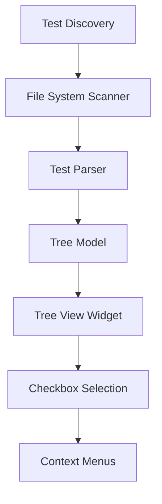
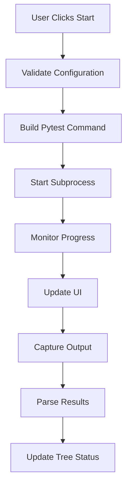
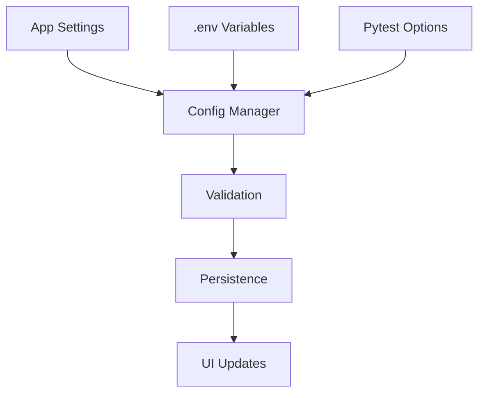

# Pytest GUI Application - Architecture Plan

## Overview
A modern GUI application built with PySide6 for running pytest tests with advanced features like test tree visualization, marker filtering, environment configuration, and real-time progress monitoring.

## Technology Stack
- **GUI Framework**: PySide6 (Qt6 for Python)
- **Testing Framework**: pytest
- **Configuration**: python-dotenv for .env files, configparser for app settings
- **Logging**: Python's built-in logging module
- **File Watching**: watchdog (for detecting test file changes)

## Application Architecture

### Core Components

#### 1. Main Application (`main.py`)
- Application entry point
- Window management
- Global application state

#### 2. Main Window (`ui/main_window.py`)
- Central widget container
- Menu bar and toolbar
- Status bar with progress information
- Layout management for all panels

#### 3. Test Discovery Engine (`core/test_discovery.py`)
- Scans filesystem for test files
- Parses pytest markers and metadata
- Builds hierarchical test structure
- Monitors file changes for auto-refresh

#### 4. Test Tree Widget (`ui/test_tree.py`)
- Hierarchical display of tests and directories
- Checkbox functionality for selection
- Context menus for test operations
- Search and filter capabilities

#### 5. Configuration Manager (`core/config_manager.py`)
- Manages application settings
- Handles .env file operations
- Pytest options configuration
- User preferences persistence

#### 6. Test Execution Engine (`core/test_runner.py`)
- Manages pytest subprocess execution
- Real-time output capture
- Progress tracking and reporting
- Start/stop/pause functionality

#### 7. Marker Filter Panel (`ui/marker_filter.py`)
- Dynamic marker discovery
- Filter UI with checkboxes
- Custom marker support
- Integration with pytest.ini

#### 8. Environment Configuration (`ui/env_config.py`)
- .env file editor
- Environment variable management
- Validation and error checking

#### 9. Pytest Options Panel (`ui/pytest_options.py`)
- Common pytest options with descriptions
- Custom command-line arguments
- Option validation and help text

#### 10. Progress and Logging (`ui/progress_panel.py`)
- Real-time progress bar
- Test execution status
- Logging output display
- Error and warning highlights

## Project Structure

```
pytest_gui/
├── main.py                     # Application entry point
├── requirements.txt            # Dependencies
├── setup.py                   # Package setup
├── pytest.ini                # Pytest configuration
├── .env.example              # Environment variables template
├── config/
│   ├── __init__.py
│   ├── app_config.py         # Application configuration
│   └── pytest_options.json  # Pytest options metadata
├── core/
│   ├── __init__.py
│   ├── test_discovery.py     # Test file scanning and parsing
│   ├── test_runner.py        # Test execution engine
│   ├── config_manager.py     # Configuration management
│   └── logger.py            # Logging setup
├── ui/
│   ├── __init__.py
│   ├── main_window.py        # Main application window
│   ├── test_tree.py          # Test tree widget
│   ├── marker_filter.py      # Marker filtering panel
│   ├── env_config.py         # Environment configuration
│   ├── pytest_options.py     # Pytest options panel
│   ├── progress_panel.py     # Progress and logging display
│   └── dialogs/
│       ├── __init__.py
│       ├── about_dialog.py   # About dialog
│       └── settings_dialog.py # Application settings
├── resources/
│   ├── icons/               # Application icons
│   ├── styles/             # QSS stylesheets
│   └── ui_files/           # Qt Designer files (optional)
├── test/
│   ├── __init__.py
│   ├── conftest.py         # Pytest fixtures
│   ├── test_sample.py      # Sample test file
│   └── integration/
│       └── test_gui.py     # GUI integration tests
└── docs/
    ├── README.md
    ├── user_guide.md
    └── developer_guide.md
```

## Key Features Implementation

### 1. Test Tree Visualization


### 2. Test Execution Flow


### 3. Configuration Management


## Data Models

### Test Node Structure
```python
class TestNode:
    path: str
    name: str
    type: TestNodeType  # FILE, DIRECTORY, TEST_FUNCTION, TEST_CLASS
    markers: List[str]
    selected: bool
    children: List[TestNode]
    parent: Optional[TestNode]
    status: TestStatus  # PENDING, RUNNING, PASSED, FAILED, SKIPPED
```

### Configuration Schema
```python
class AppConfig:
    test_directory: str
    pytest_executable: str
    auto_discover: bool
    max_workers: int
    log_level: str
    theme: str
    window_geometry: dict
```

## User Interface Design

### Main Window Layout
- **Left Panel**: Test tree with selection checkboxes
- **Center Panel**: Configuration tabs (Markers, Environment, Options)
- **Right Panel**: Progress and logging output
- **Bottom Panel**: Control buttons and status bar

### Key UI Components
1. **Test Tree**: Hierarchical view with checkboxes
2. **Marker Filter**: Dynamic checkbox list
3. **Environment Editor**: Key-value pair editor
4. **Options Panel**: Categorized pytest options
5. **Progress Bar**: Real-time execution progress
6. **Log Viewer**: Syntax-highlighted output

## Technical Considerations

### Performance
- Lazy loading for large test suites
- Background test discovery
- Efficient tree updates
- Memory management for long-running sessions

### Error Handling
- Graceful subprocess failures
- Configuration validation
- User-friendly error messages
- Recovery mechanisms

### Extensibility
- Plugin architecture for custom features
- Configurable UI themes
- Custom marker support
- Export/import functionality

## Development Phases

### Phase 1: Core Infrastructure
- Basic window and layout
- Test discovery engine
- Simple test tree display

### Phase 2: Test Execution
- Pytest integration
- Progress monitoring
- Basic logging

### Phase 3: Advanced Features
- Marker filtering
- Environment configuration
- Options management

### Phase 4: Polish and Distribution
- Error handling
- Documentation
- Packaging
- Testing

This architecture provides a solid foundation for a professional pytest GUI application with room for future enhancements and customization.