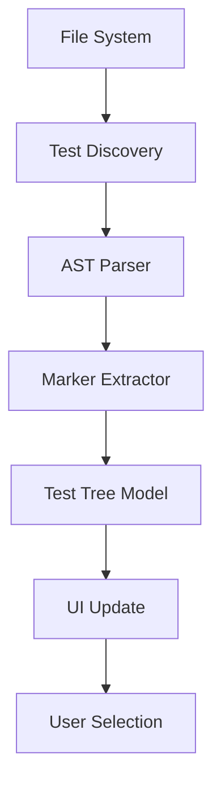
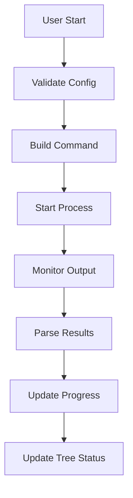

# Pytest GUI Application - Technical Specification

## Dependencies and Requirements

### Core Dependencies
```
PySide6>=6.5.0          # GUI framework
pytest>=7.0.0           # Testing framework
python-dotenv>=1.0.0    # Environment variable management
watchdog>=3.0.0         # File system monitoring
psutil>=5.9.0           # Process management
configparser>=5.3.0     # Configuration file handling
```

### Development Dependencies
```
pytest-qt>=4.2.0       # GUI testing
black>=23.0.0           # Code formatting
flake8>=6.0.0           # Linting
mypy>=1.0.0             # Type checking
```

## Core Components Implementation

### 1. Test Discovery Engine (`core/test_discovery.py`)

#### Key Classes
```python
class TestNode:
    """Represents a node in the test tree"""
    def __init__(self, path: str, name: str, node_type: TestNodeType):
        self.path = path
        self.name = name
        self.type = node_type
        self.markers: List[str] = []
        self.selected = False
        self.children: List[TestNode] = []
        self.parent: Optional[TestNode] = None
        self.status = TestStatus.PENDING

class TestDiscovery:
    """Discovers and parses test files"""
    def __init__(self, root_path: str):
        self.root_path = root_path
        self.file_watcher = Observer()
        
    def discover_tests(self) -> TestNode:
        """Scan filesystem and build test tree"""
        
    def parse_test_file(self, file_path: str) -> List[TestNode]:
        """Extract test functions and classes from file"""
        
    def extract_markers(self, test_path: str) -> List[str]:
        """Extract pytest markers from test"""
```

#### Implementation Details
- Use `ast` module to parse Python files without executing them
- Extract pytest markers using regex patterns and AST analysis
- Implement file watching for automatic test discovery updates
- Cache parsed results to improve performance on large test suites

### 2. Test Tree Widget (`ui/test_tree.py`)

#### Key Features
```python
class TestTreeWidget(QTreeWidget):
    """Custom tree widget for displaying tests"""
    
    def __init__(self):
        super().__init__()
        self.setHeaderLabels(['Test', 'Status', 'Markers'])
        self.itemChanged.connect(self.on_item_changed)
        
    def populate_tree(self, root_node: TestNode):
        """Populate tree from test discovery results"""
        
    def update_selection_state(self, item: QTreeWidgetItem):
        """Handle checkbox state changes with parent/child logic"""
        
    def get_selected_tests(self) -> List[str]:
        """Return list of selected test paths"""
```

#### Checkbox Logic
- Parent selection affects all children
- Child selection affects parent state (partial/full)
- Support for "Select All" and "Deselect All" operations
- Visual indicators for different selection states

### 3. Test Execution Engine (`core/test_runner.py`)

#### Process Management
```python
class TestRunner:
    """Manages pytest execution"""
    
    def __init__(self):
        self.process: Optional[subprocess.Popen] = None
        self.is_running = False
        
    def start_tests(self, test_paths: List[str], options: Dict[str, Any]):
        """Start pytest execution with given parameters"""
        
    def stop_tests(self):
        """Gracefully stop running tests"""
        
    def parse_output(self, line: str) -> TestResult:
        """Parse pytest output for progress updates"""
```

#### Output Parsing
- Real-time parsing of pytest output
- Extract test results, progress, and error information
- Support for pytest's various output formats
- Handle both verbose and quiet modes

### 4. Configuration Management (`core/config_manager.py`)

#### Configuration Structure
```python
class ConfigManager:
    """Manages application and pytest configuration"""
    
    def __init__(self):
        self.app_config = AppConfig()
        self.env_vars: Dict[str, str] = {}
        self.pytest_options: Dict[str, Any] = {}
        
    def load_config(self):
        """Load configuration from files"""
        
    def save_config(self):
        """Save current configuration"""
        
    def get_pytest_command(self, test_paths: List[str]) -> List[str]:
        """Build pytest command with all options"""
```

#### File Formats
- Application settings: JSON format
- Environment variables: .env format
- Pytest configuration: pytest.ini integration

### 5. UI Components

#### Main Window Layout (`ui/main_window.py`)
```python
class MainWindow(QMainWindow):
    """Main application window"""
    
    def __init__(self):
        super().__init__()
        self.setup_ui()
        self.setup_connections()
        
    def setup_ui(self):
        """Initialize UI components and layout"""
        # Left panel: Test tree
        # Center panel: Configuration tabs
        # Right panel: Progress and logs
        # Bottom: Control buttons and status
```

#### Marker Filter Panel (`ui/marker_filter.py`)
```python
class MarkerFilterWidget(QWidget):
    """Widget for filtering tests by markers"""
    
    def __init__(self):
        super().__init__()
        self.marker_checkboxes: Dict[str, QCheckBox] = {}
        
    def update_markers(self, markers: List[str]):
        """Update available markers dynamically"""
        
    def get_selected_markers(self) -> List[str]:
        """Return list of selected markers"""
```

#### Environment Configuration (`ui/env_config.py`)
```python
class EnvConfigWidget(QWidget):
    """Widget for managing environment variables"""
    
    def __init__(self):
        super().__init__()
        self.env_table = QTableWidget()
        self.setup_table()
        
    def load_env_file(self, file_path: str):
        """Load environment variables from .env file"""
        
    def save_env_file(self, file_path: str):
        """Save current environment variables"""
```

## Data Flow Architecture

### Test Discovery Flow


### Test Execution Flow


## Error Handling Strategy

### Categories of Errors
1. **Configuration Errors**: Invalid pytest.ini, missing dependencies
2. **File System Errors**: Permission issues, missing test directories
3. **Execution Errors**: Pytest crashes, syntax errors in tests
4. **UI Errors**: Widget initialization failures, layout issues

### Error Recovery
- Graceful degradation when features fail
- User-friendly error messages with suggested solutions
- Automatic retry mechanisms for transient failures
- Logging all errors for debugging

## Performance Considerations

### Optimization Strategies
1. **Lazy Loading**: Load test details only when needed
2. **Background Processing**: Run test discovery in separate threads
3. **Caching**: Cache parsed test information
4. **Efficient Updates**: Minimize UI redraws during execution

### Memory Management
- Limit output buffer size for long-running tests
- Clean up subprocess resources properly
- Use weak references where appropriate
- Monitor memory usage in development

## Security Considerations

### Input Validation
- Sanitize file paths and command arguments
- Validate environment variable names and values
- Prevent code injection through configuration

### Process Security
- Run pytest in controlled environment
- Limit subprocess permissions
- Handle untrusted test code safely

## Testing Strategy

### Unit Tests
- Test discovery logic
- Configuration management
- Output parsing
- UI component behavior

### Integration Tests
- End-to-end test execution
- File system operations
- Configuration persistence
- UI interactions

### GUI Tests
- Widget functionality using pytest-qt
- User interaction scenarios
- Layout and styling verification

## Deployment and Distribution

### Packaging Options
1. **PyInstaller**: Single executable for easy distribution
2. **cx_Freeze**: Cross-platform freezing
3. **pip package**: For Python developers
4. **Docker**: Containerized deployment

### Platform Support
- Windows 10/11
- macOS 10.15+
- Linux (Ubuntu 20.04+, CentOS 8+)

### Installation Requirements
- Python 3.8+
- Qt6 system libraries
- Sufficient disk space for test outputs

This technical specification provides the detailed implementation guidance needed to build a robust and professional pytest GUI application.